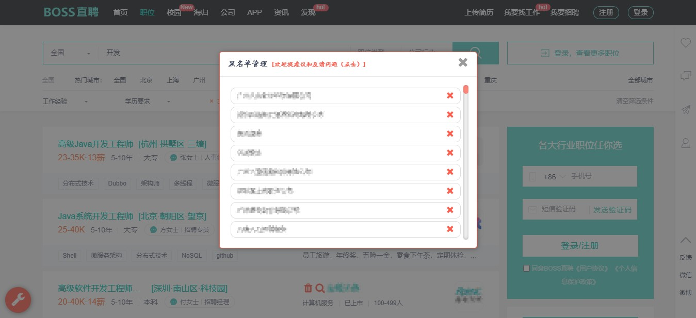
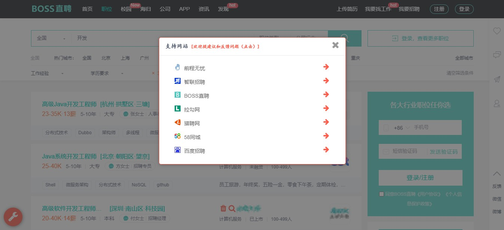
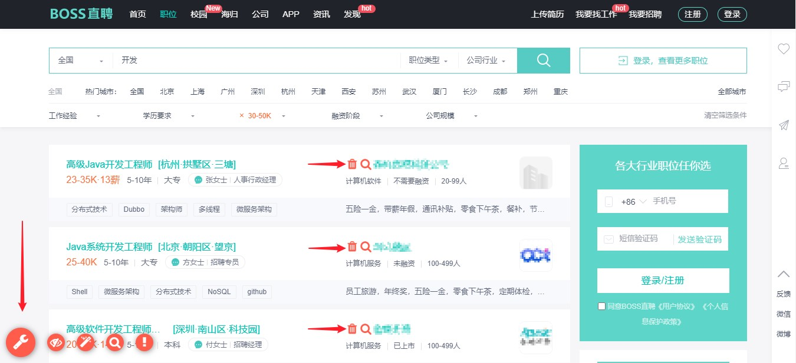
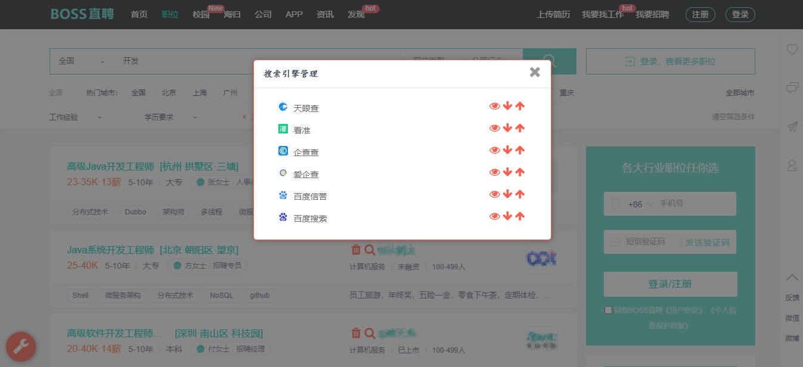

# 高级求职助手/招聘网站助手

- 快捷添加公司/企业黑名单，眼不见心不烦
- 支持全网热门招聘网站，前程无忧、智联招聘、BOSS直聘、拉钩网、猎聘网、百度百聘、58同城
- 快捷公司/企业信息查询，支持天眼查、看准、企查查、百度信誉、百度搜索
- 全网招聘网站黑名单数据连通，一站添加，全网使用
- 让长期挂网招聘、黑色（灰色）招聘、培训机构通通消失
- 您的求职你做主，加油
- 代码开源，放心使用（[点个star支持项目](https://github.com/qq943260285/tampermonkey-recruitment-tool)）

## 安装使用
#### Greasy Fork安装

[安装地址](https://greasyfork.org/zh-TW/scripts/380848)

## 测试使用

- 前程无忧测试：

  

- 智联招聘测试：

  

- BOOS直聘测试

  

- 黑名单管理测试：

  

## 许可 

[MPL3.0](LICENSE) 
